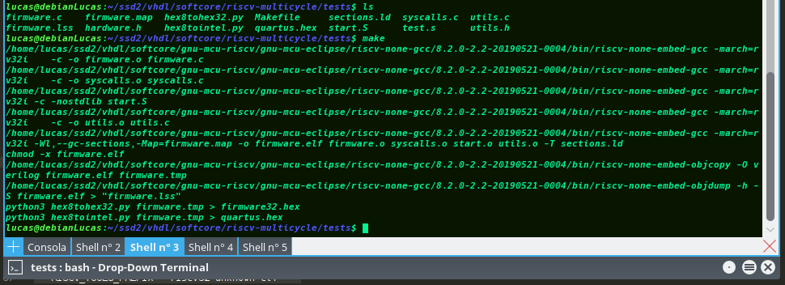

# RISC SoftCore
---

RISC SoftCore é uma implementação em VHDL com fins diádicos do conjunto de instruções RISCV RV32I. Essa versão particular não implementa um pipeline. A ideia é criar um microcontrolador com periféricos comuns como I2C, USART, SPI e GPIOs inicialmente utilizado para disciplina de Dispositivos Lógicos Programáveis.

Ferramentas de programação podem ser obtidas no [RISC-V Website](https://riscv.org/software-status/).

## Getting Started (hardware):

- Simulação:
    - ModelSim: execução do script testbench.do
    - testbench: ./core/testbench.vhd
    - Utilizar uma memória SRAM IP (32-bits x 1024 words):
        - Quartus RAM: catálogo de IPS, RAM 1-port
        - Na aba de confguração  __Regs/Clken/Byte Enable/AClrs__, desabilite __'q' output port__ e habilite __Create byte enable for port A__
        - Na aba de configuração __Mem Init__, habilite e configure o arquivo de inicialização da memória de instruções para __quartus.hex__
        - Na aba de configuração __Mem Init__, habilite Allow In-System Memory Content Editor.
    - Se necessário, altere o caminho do arquivo de inicialização de memória (__quartus.hex__) no arquivo iram_quartus.vhdl

- Síntese: Quartus 15 ou superior (testado no Kit de desenvolvimento DE10-Lite)
    - Projeto: utilize ./sint/de10_lite
    - Para gravação do programa pós síntese:
        - Utilizar uma memória SRAM IP (32-bits x 1024 words Quartus RAM
        - Gravação pelo Tools -> In-System Memory Editor
    - Utilize uma PLL para ajuste do clock

## Getting Started (software):

A compilação de programas necessita do _toolchain_ __riscv32-unknown-elf__ suportando o subconjunto RV32I. Em ./tests/ há um exemplo bem simples de Makefile. Perceba que na fase atual do projeto utilizamos um _script_ de _linker_ customizado (sections.ld). libc ainda não foi testado/suportado.

### Instalação do compilador no Linux

Guia para instalação no [gnu-mcu-eclipse.github.io](https://gnu-mcu-eclipse.github.io/toolchain/riscv/install/#gnulinux)

Toolchain Release: riscv-none-gcc [Github](https://github.com/gnu-mcu-eclipse/riscv-none-gcc/releases).

1. Atualizar Makefile com o diretório da toolchain. 

Exemplo:

```RISCV_TOOLS_PREFIX = /home/lucas/ssd2/vhdl/softcore/gnu-mcu-riscv/gnu-mcu-eclipse/riscv-none-gcc/8.2.0-2.2-20190521-0004/bin/riscv32-unknown-elf-```

2. Para compilar, _make_.



### Instalação do compilador no Windows (Windows Subsystem for Linux)

1. Instalar o WSL: [Microsoft Docs](https://docs.microsoft.com/en-us/windows/wsl/install-win10)
2. Instalar o Ubuntu no WSL
3. No shell Ubuntu (bsusque Ubuntu no Iniciar do Windows):
4. Instalar os pacotes para o nodejs:

```sudo apt update
sudo apt upgrade
sudo apt install nodejs
sudo apt install npm
sudo npm --global install xpm
```

5. Instalar por xmp [GNU Eclipse](https://gnu-mcu-eclipse.github.io/toolchain/riscv/install/):

```xpm install --global @gnu-mcu-eclipse/riscv-none-gcc```

6. Altere o caminho do compilador no _Makefile_:
	- de:
```RISCV_TOOLS_PREFIX = riscv32-unknown-elf-```
	- para:
```RISCV_TOOLS_PREFIX = ~/opt/xPacks/@<versão compilador>/.contents/bin/riscv-none-embed-```

7. Utilizando o shell Ubuntu,  mude o diretório atual para o repositório:

```cd /mnt/c/<caminho sistema arquivos Windows>```

8. Para compilar, _make_.

Após a compilação, mova, copie ou faça um _link_ simbólico de ./tests/quartus.hex para a raiz do projeto.

## Simulador Assembly:

RISV baseado no MARS: [RARS](https://github.com/TheThirdOne/rars)
