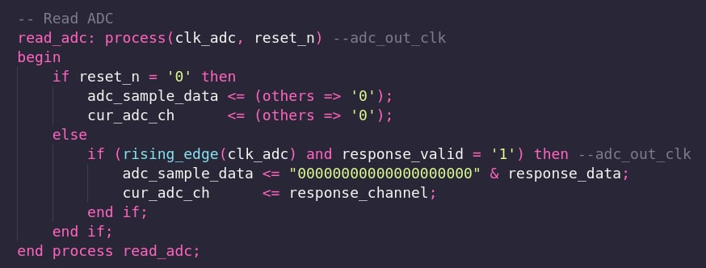
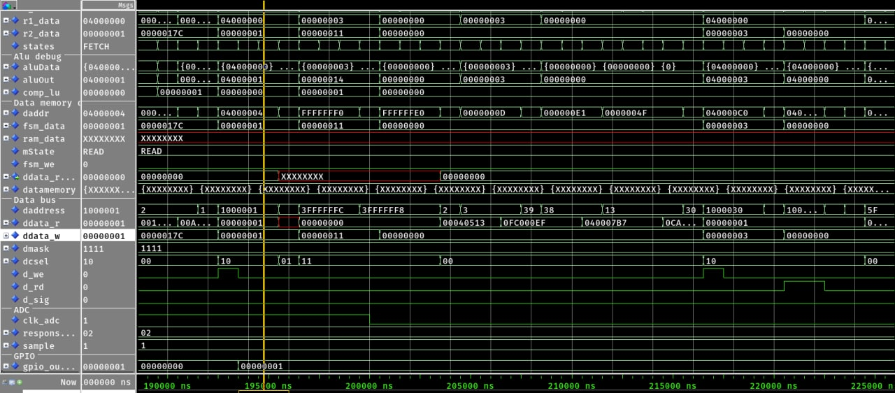

# DOCUMENTAÇÃO ADC

## ADC

A implementação do ADC trata-se de um bloco IP da Altera, foi configurado pelo arquivo 'adc_qsys.qsys' utilizando-se a ferramenta própria da Altera. Nesta implementação, o ADC conta com 16 canais de 12 bits.

Para a aquisição ser feita, a resposta precisa ser validadaa pelo próprio bloco de IP, por isso o processo abaixo foi criado.



## Simulação

Como blocos de IP's não são simuláveis foi criado o arquivo 'adc_bus.vhd' que simula o funcionamento do ADC  este ainda utiliza o 'adc_qsysbus.vhd' (simula a ferramenta da Altera), onde foi inserido valores fixos de samples para verificar a integração com o softcore. Os arquivos 'tb_adc.vhd' e 'tb_adc.do' implementam a simulação, mostrado abaixo.



## Implementação

Na implementação foi necessário outro componente em que fosse possível realizar a síntese, o 'adc_core.vhd'. Para a seleção do canal, um valor é lido no endereço "0x30" do barramento de dados, enquanto para obter o valor lido pelo ADC é escrito no endereço "0x31".
No arquivo "hardware_ADC_7SEG.h" está definida uma estrutura de dados para armazenar o valor lido do ADC e seu respectivo canal, que será utilizadp pelo 'de10lite.vhd', bem como a declaração das funções para ler o ADC e escrever nos displays de 7 segmentos.


## Software

Em 'hardware.h' foi definido o endereço de cada periférico.

```c
#define IONBUS_BASE_ADDRESS 		(*(_IO32 *) (PERIPH_BASE))			    
#define SEGMENTS_BASE_ADDRESS 		(*(_IO32 *) (PERIPH_BASE + 1*16*4))		
#define UART_BASE_ADDRESS 			(*(_IO32 *) (PERIPH_BASE + 2*16*4))	
#define ADC_BASE_ADDRESS 		    (*(_IO32 *) (PERIPH_BASE + 3*16*4))		
#define I2C_BASE_ADDRESS 			(*(_IO32 *) (PERIPH_BASE + 4*16*4))	
#define TIMER_BASE_ADDRESS 			(*(_IO32 *) (PERIPH_BASE + 5*16*4))		
#define SPI_BASE_ADDRESS 		    (*(_IO32 *) (PERIPH_BASE + 6*16*4))	
```

No arquivo 'adc.h' foi estabelecido a estrutura de dados para a leitura e escrita no barramento de dados, além dos escopos das funçoes.

```c
typedef struct 
{
	uint32_t sel_channel;   
	uint32_t indata_adc;
}ADC_TYPE;

#define OUTBUS  *(&IONBUS_BASE_ADDRESS + 1)
#define ADC ((ADC_TYPE *) &ADC_BASE_ADDRESS)

uint32_t adc_read (uint32_t channel_sel);
```

Em 'adc.c' foi criado a função que envia qual o canal a ser lido e recebe a resposta com o valor do sample.

```c
#include "adc.h"

uint32_t adc_read (uint32_t channel_sel)
{
	ADC -> sel_channel = channel_sel;
    return ADC -> indata_adc;
}
```

No arquivo `main_adc.c` mostra um exemplo de funcionamento.

```c
	int main(){	

		uint32_t adc_value;
		uint32_t adc_ch = 1;
		
		//x faz a varredura dos canais para teste!
		while (1){
			if (adc_ch == 17)
				adc_ch = 1;
			
			adc_value = adc_read(adc_ch);
			delay_(100000);
			adc_ch++;
			OUTBUS = adc_value;
		}
		return 0;
	}
```
