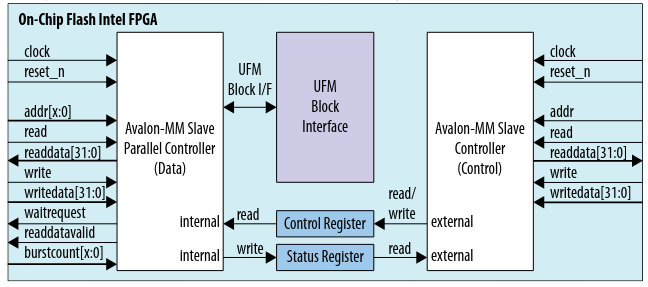
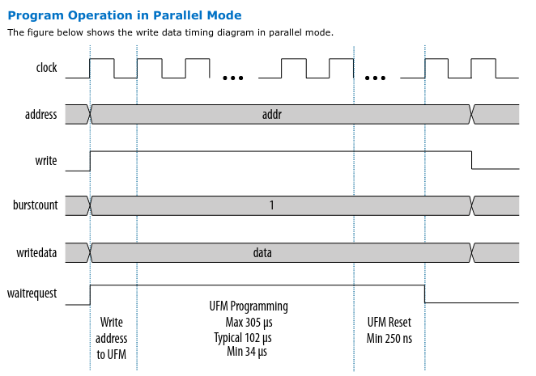
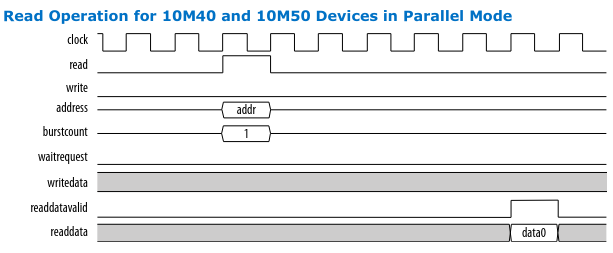

# Introdução e organização

Módulo para controlar a flash interna do Quartus. Como este módulo está
organizado:

```
flash
├── dummy                   # Pasta com versão da flash "dummy" isto é, flash falsa para testar seu comportamento
│   ├── flash_bus.vhd       # componente da flash dummy
│   ├── testbench_core.vhd  # simulação da flash dummy integrada ao core
│   ├── testbench_flash.vhd # simulação da flash dummy sozinha, sem o core
├── flash_bus.vhd           # componente da on-chip flash
├── sint_core_no            # projeto do quartus com a flash e sem core, para testar comportamento da flash através de probe and source
├── sint_core_yes           # projeto do quartus com a flash e com core (neste que o software da flash é carregado)
├── testbench_flash.vhd     # simulação da on-chip flash, utilizando arquivos de simulação da flash gerados pelo quartus 
```

## Trabalhos futuros (TODOs)

- fazer a flash interna do quartus (a "verdadeira") funcionar corretamente bem
  como sua simulação
- adicionar operação de apagamento (em blocos)
- adicionar operação escrita (em blocos) para otimizar a vida útil da flash

Essas duas últimas operações (apagamento e escrita em blocos) são totalmente
suportadas pela flash interna do quartus, o que falta é adicionar suporte e
interface a elas através deste módulo aqui (flash bus).

# User Flash Memory (UFM)

A flash interna do Quartus (UFM) utiliza a interface Avalon-MM para se comunicar
com o mundo externo.

Um array contém sectors. Um setor contém pages. Um page equivale a 64 Kb no
device 10M50. A seguinte tabela mostra como os setores foram organizados através
do IP Parameter Editor do Quartus:

| Sector ID | Access Mode | Address Mapping (byte based) | Addr. Mapping (32-bit based) | Type |
| --------- | ----------- | ---------------------------- | ---------------------------- | ---- |
| 1         | R/W         | 0x00000 - 0x007fff           | 0x00000 - 0x001fff           |  UFM |
| 2         | R/W         | 0x08000 - 0x00ffff           | 0x02000 - 0x003fff           |  UFM |
| 3         | R/W         | 0x10000 - 0x06ffff           | 0x04000 - 0x01bfff           |  CFM |
| 4         | R/W         | 0x70000 - 0x0b7fff           | 0x1c000 - 0x02dfff           |  CFM |
| 5         | R/W         | 0xb8000 - 0x15ffff           | 0x2e000 - 0x057fff           |  CFM |

Observação: o endereço do IP Parameter Editor é byte based, enquanto que o
endereço no barramento avalon-mm é 32-bit based, então é necessário considerar
essa diferença na leitura/escrita da flash. Para converter, basta pegar o
endereço byte based e dividir por 4 para achar o endereço equivalente no
barramento avalon-mm.

O tipo configuration flash memory (CFM) é usado para armazenar imagens de
configuração enquanto a user flash memory (UFM) é usada para armazenar imagens
(aplicações) e dados do usuário. 

A UFM opera em dois modos de escrita/leitura: paralelo e serial. Por hora
somente o modo paralelo é suportado nesta implementação aqui em questão. Uma
sugestão de trabalho futuro é suportar o modo serial.

A figura seguinte mostra a interface da Flash On-Chip fornecida pelo Quartus.



## periférico flash bus: camada de abstração entre barramento avalon e core

Este periférico em questão se responsabiliza por fornecer uma interface (de
abstração) para o core através da qual é possível realizar operações na Flash. O
arquivo responsável por essa ponte entre os dois barramentos é o
`flash_bus.vhd`.

Internamente o `flash_bus.vhd` utiliza o IP da Flash fornecido/gerado pelo
Quartus (tanto para simulação quanto para o hardware).

As duas seções seguintes explicam as operações de escrita e leitura possíveis
sobre a interface de dados da Flash (Data). Para mais detalhes ou informações
sobre essas e outras operações, veja a referência.

## Operação de escrita (write) de 32 bits

1 - Setar o bit 'write protection mode' para '0' referente ao sector da flash
que será escrito. Existe um bit para cada 1 dos 5 sectors no registrador Core
Control. Escreve-se neste registrador através da unidade de controle (Control).

Depois disso, o processo de escrita é explicado pela figura seguinte.



'address' recebe o endereço no qual será escrito o valor de 'writedata', e o
sinal 'write' e 'burstcount' devem ser setados para 1. O sinal 'waitrequest' é
setado pela flash enquanto a operação de escrita estiver em andamento. Após a
operação de escrita concluida, o bit 'write protection mode' deve ser setado de
volta para '1'. O sucesso (ou insucesso) da operação de escrita é informado no
registrador de status (bloco Control).

## Operação de leitura (read) de 32 bits em modo paralelo

Para a fazer a leitura da UFM comunica-se apenas com a unidade de dados (Data),
isto é, não precisa fazer a comunicação com a unidade de controle (Control).

Passo-a-passo para fazer a leitura de uma palavra de 32 bits em modo paralelo:

1. read = '1'
2. burst = "0001"
3. addr recebe o endereço que deseja-se ler

Se a flash estiver ocupada com outra tarefa, ela colocará o sinal waitrequest =
'1'. Após completar operação de leitura, a flash seta readdatavalid = '1' e o
valor da memória no endereço addr é setado em readdata. A seguinte imagem
ilustra o processo (considerando que a flash não estava ocupada):



O sucesso (ou insucesso) da operação de leitura é informado no registrador de
status (bloco Control).

## Execução do periférico flash bus

Atualmente o IP da Flash não funcionou na simulação nem na placa. O que acontece
é que o sinal 'waitrequest' da flash fica sempre em '1' após o término da
aplicação do sinal de reset (inicialização do IP). Esse comportamento não
esperado pode ser visto ao simular o testbench `testbench_flash.vhd` (Veja a
seção `Simulação` para mais detalhes).

O comportamento também pode ser visto ao executar na placa. O projeto do quartus
está localizado na pasta `./sint_core_no/de10_lite`. O arquivo `de10_lite.vhd`
faz as seguintes associações no hardware:

| pino           | sinal        |
|------          |-------       |
| SW9            | rst          |
| SW0            | clk          |
| SW1            | d_we         |
| SW2            | d_rd         |
| probe(31..0)   | ddata_r      |
| probe(32)      | waitrequest  |
| probe(64..33)  | csr_readdata |
| source(63..32) | ddata_w      |
| source(31..0)  | daddress     |

Assim, utilizando o probe & request é possível  controlar as entradas e
visualizar algumas saídas. 

Obs.: os sinais 'csr_readata' e 'waitrequest' não são necessários e foram
adicionados meramente por questões de debug. 

## Simulação

Os arquivos de simulação foram gerados no IP Parameter Editor e estão na pasta
`./sint_core_no/de10_lite/flash/simulation`. Há scripts para diferentes vendors
(aldec, cadence, mentor, synopsys) entre outros arquivos .vhd e .v.

### build "manual", isto é, sem usar scripts de vendors

Executar no terminal do ModelSim:

```
do testbench_flash.do
```

obs.: Talvez faça-se necessário ajustar a variável `QUARTUS_INSTALL_DIR` no
arquivo `testbench_flash.do`.

A flash simulada neste testbench responde a alguns estimulos mas fica com o
sinal `waitrequest` sempre em '1' após reset. Isso não é esperado. Um possível
motivo para este comportamento está em alguns warnings que foram gerados durante
o build, entre eles:

```
** Warning: (vsim-2685) [TFMPC] - Too few port connections for 'ufm_data_shiftreg'.  Expected 11, found 6.
...
** Warning: (vsim-2685) [TFMPC] - Too few port connections for 'altera_onchip_flash_block'.  Expected 18, found 17.
...
** Warning: (vsim-3722) sint/flash/simulation/submodules/altera_onchip_flash.v(302): [TFMPC] - Missing connection for port 'bgpbusy'.
```

### build com script do vendor mentor

Build para o vendor `mentor`, no terminal do ModelSim ("Compile all the design
files and elaborate the top level design"):

```
cd ./sint/de10_lite/flash/simulation/mentor
do msim_setup.tcl
ld
```

Alguns erros/warnings aparecem, também:

```
# ** Warning: (vsim-2685) [TFMPC] - Too few port connections for 'ufm_data_shiftreg'.  Expected 11, found 6.
#    Time: 0 ps  Iteration: 0  Instance: /flash/onchip_flash_0/avmm_data_controller/genblk6/ufm_data_shiftreg File: ./../submodules/altera_onchip_flash_avmm_data_controller.v Line: 1175
# ** Warning: (vsim-3722) ./../submodules/altera_onchip_flash_avmm_data_controller.v(1175): [TFMPC] - Missing connection for port 'shiftin'.
# ** Warning: (vsim-3722) ./../submodules/altera_onchip_flash_avmm_data_controller.v(1175): [TFMPC] - Missing connection for port 'aset'.
# ** Warning: (vsim-3722) ./../submodules/altera_onchip_flash_avmm_data_controller.v(1175): [TFMPC] - Missing connection for port 'sclr'.
# ** Warning: (vsim-3722) ./../submodules/altera_onchip_flash_avmm_data_controller.v(1175): [TFMPC] - Missing connection for port 'sset'.
# ** Warning: (vsim-3722) ./../submodules/altera_onchip_flash_avmm_data_controller.v(1175): [TFMPC] - Missing connection for port 'q'.
# ** Warning: (vsim-2685) [TFMPC] - Too few port connections for 'altera_onchip_flash_block'.  Expected 18, found 17.
#    Time: 0 ps  Iteration: 0  Instance: /flash/onchip_flash_0/altera_onchip_flash_block File: ./../submodules/altera_onchip_flash.v Line: 302
# ** Warning: (vsim-3722) ./../submodules/altera_onchip_flash.v(302): [TFMPC] - Missing connection for port 'bgpbusy'.
# ** Warning: (vsim-2685) [TFMPC] - Too few port connections for '<protected>'.  Expected <protected>, found <protected>.
#    Time: 0 ps  Iteration: 0  Protected: /flash/onchip_flash_0/altera_onchip_flash_block/inst/<protected>/<protected>/<protected>/<protected>/<protected> File: /home/rgnagel/intelFPGA_lite/20.1/quartus/eda/sim_lib/mentor/fiftyfivenm_atoms_ncrypt.v Line: 38
# ** Warning: (vsim-3722) <protected>(<protected>): [TFMPC] - Missing connection for port '<protected>'.
# ** Warning: (vsim-3722) <protected>(<protected>): [TFMPC] - Missing connection for port '<protected>'.
```

# Referências

- As figuras e explicações do IP da Flash on-chip, na sua maioria, foram
  extraídos do seguinte link:
  https://www.intel.com/content/dam/www/programmable/us/en/pdfs/literature/hb/max-10/ug_m10_ufm.pdf


