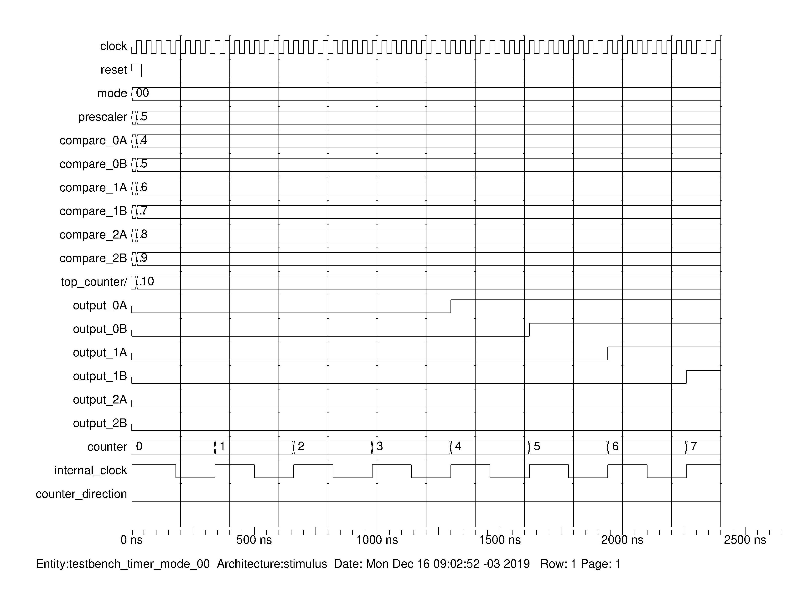
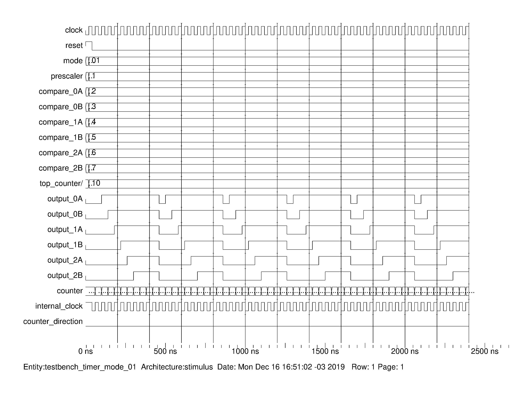
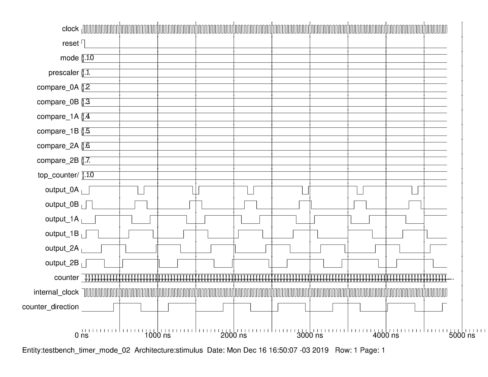

# Timer

Esta é uma implementação para um timer em VHDL.

## Descrição dos pinos

- `clock`: sinal de entrada de clock. O contador interno do timer funciona na borda de subida do clock.
- `reset`: sinal de reset do contador. O contador interno do timer é zerado, juntamente com sua saída, quando nível do sinal `reset` é alto.
- `timer_mode`: o sinal de configuração do modo de funcionamento do timer (mais informações em [Modos de Funcionamento](#modos-de-funcionamento)).
- `prescaler`: o sinal de configuração para a frequência de contagem. O clock interno do timer será o sinal `clock` divido pelo valor do `prescaler`.
- `compare`: o sinal de configuração para o valor de comparação do contador interno. Sua ação depende do modo de funcionamento configurado pelo sinal `timer_mode` (mais informações em [Modos de Funcionamento](#modos-de-funcionamento)).
- `output`: o sinal de saída do timer. Sua ação depende do modo de funcionamento configurado pelo sinal `timer_mode` (mais informações em [Modos de Funcionamento](#modos-de-funcionamento)).
- `inv_output`: sinal de saída logicamente complementar ao `output`.

## Modos de funcionamento
No momento três modos foram implementados: __Oneshot mode__, que pode ser utilizado para uma _contagem simples_, e os modos __Clear on compare mode__, que podem ser utilizado para sinais periódicos simples como _PWM_.

### Oneshot mode (`00`)
Neste modo o contador interno do timer conta até valor de comparação (configurado pelo sinal `compare`) e seu sinal saída `output` fica habilitado até receber o sinal `reset` em nível baixo.

Simulação: 

    

### Clear on compare mode - sawtooth (`01`)
Neste modo o contador interno do timer conta até valor máximo dele (o valor decimal 2^{32}-1) e é zerado automaticamente. Seu sinal de saída `output` fica em níve alto sempre quando o contador for maior ou igual ao valor do sinal de comparação `compare`.  
- `output = 0` enquanto o contador interno for menor que `compare`.
- `output = 1` se contagem for maior que `compare`.

Simulação: 

    

### Clear on compare mode - triangular (`02`)
Neste modo o contador interno do timer conta progressivamente até valor máximo dele (o valor decimal 2^{32}-1), passa a contar regressivamente, até que chega em zero e passa a contar progressivamente novamente e assim segue ciclicamente. Seu sinal de saída `output` fica em níve alto sempre quando o contador for maior ou igual ao valor do sinal de comparação `compare`.  
- `output = 0` enquanto o contador interno for menor que `compare`.
- `output = 1` se contagem for maior que `compare`.

Simulação: 

    

